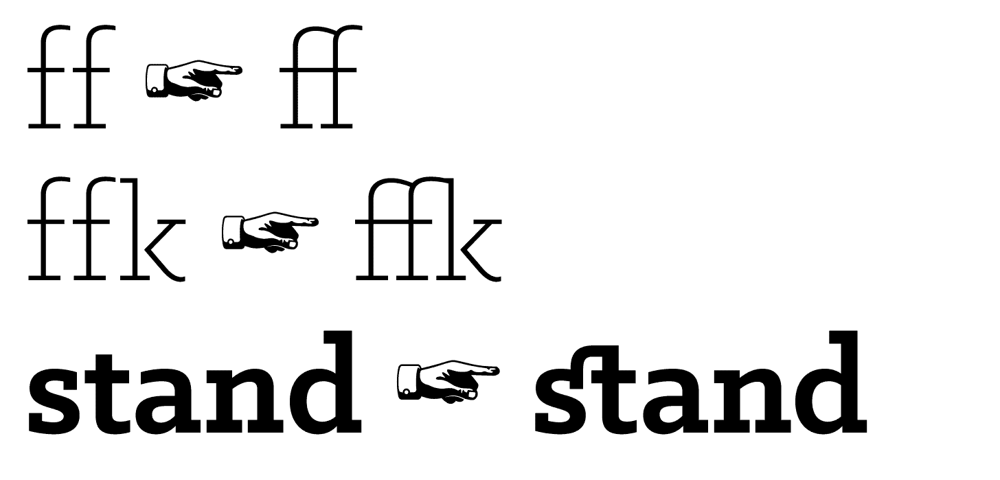
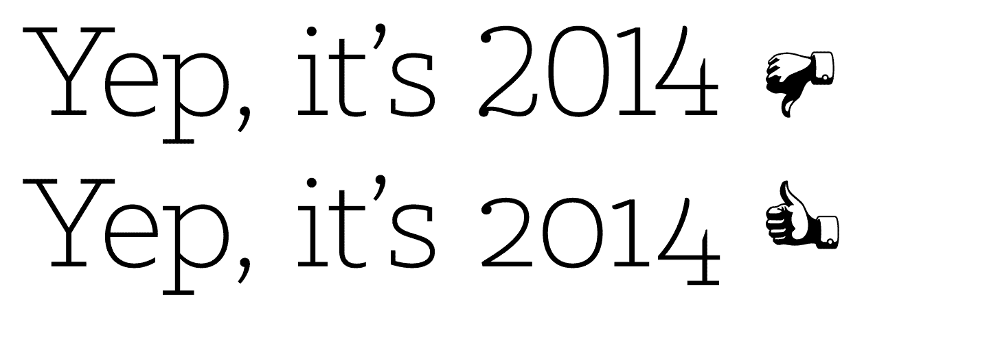
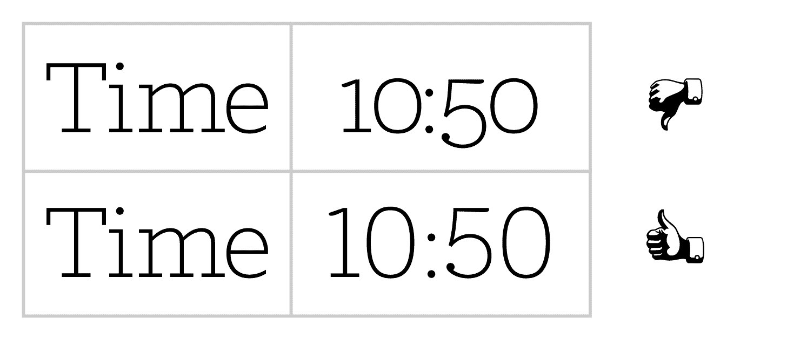
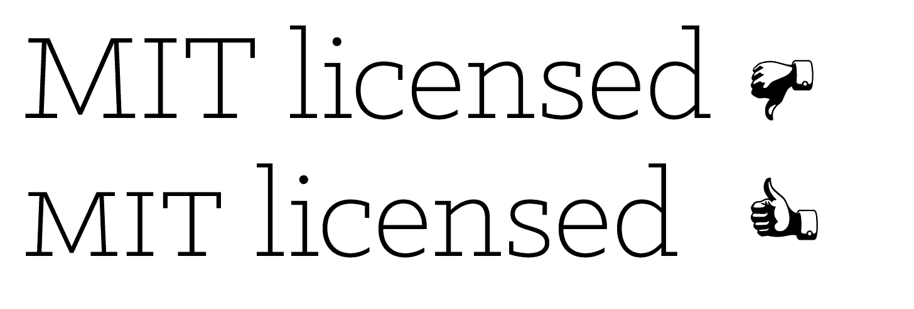
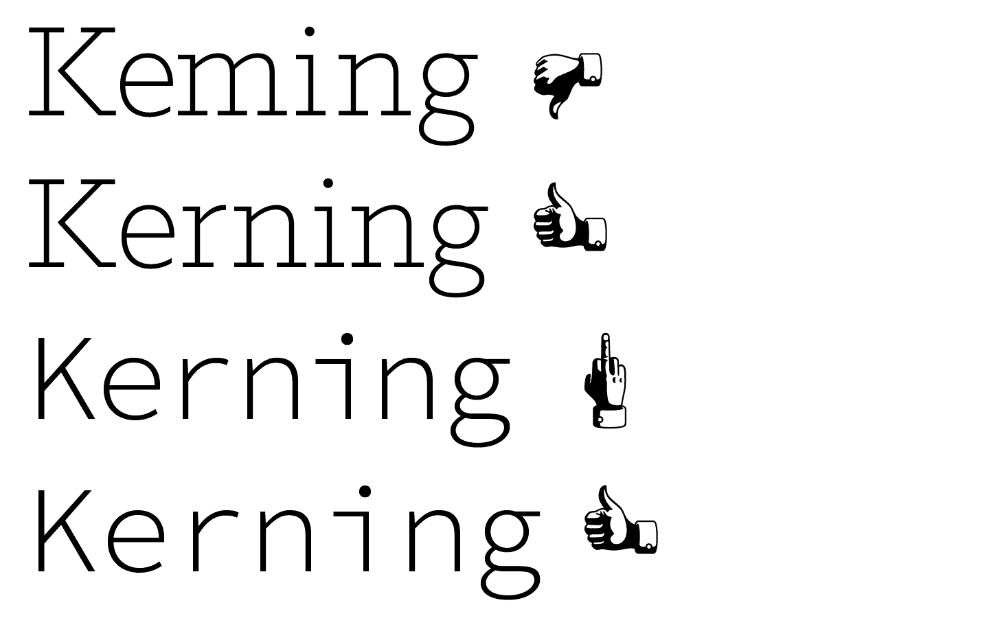

# OpenType Settings

Adds OpenType features—ligatures, kerning, and more—to [Normalize.css](https://github.com/necolas/normalize.css).

## Ligatures

First, normalize basic ligatures across browsers, and then get fancier, discretionary ligatures on `<h1>`, `<h2>`, and `<h3>`s.

## Numerals

Different situations require different numerals, depending on the context. Normalize-OpenType.css takes care of this for you, so you don’t need to know what combination of Proportional, Lining, Tabular, and Old-Style numerals you need to use.

## Small Capitals

Regular capitals draw a lot of attention in body copy. With Normalize-OpenType.css, anything wrapped in `<abbr>` will use small capitals instead. This works especially well with [Typogr.js](https://github.com/ekalinin/typogr.js) and equivalents.

## Kerning

Kerning is turned on by default everywhere, and carefully turned off where it isn’t appropriate. A monospaced typeface’s application is ruined when automatic kerning is turned on. This is not the case with Normalize-OpenType.css; your code blocks have been preserved.

## …and more

There’s more optimisations included, so you don’t have to think about them: Lining, tabular numerals in code blocks, uppercase fallbacks for small capitals, and proper subscript and superscripts.

## Issues (original ones)

[Issues](https://github.com/kennethormandy/normalize-opentype.css/issues)

## Related Projects

[Original normalize-opentype.css](https://github.com/kennethormandy/normalize-opentype.css)
[Utility OpenType](https://github.com/kennethormandy/utility-opentype)

## License

[The MIT License (MIT)](LICENSE.md)

Copyright © 2014–2015 [Kenneth Ormandy](http://kennethormandy.com)
